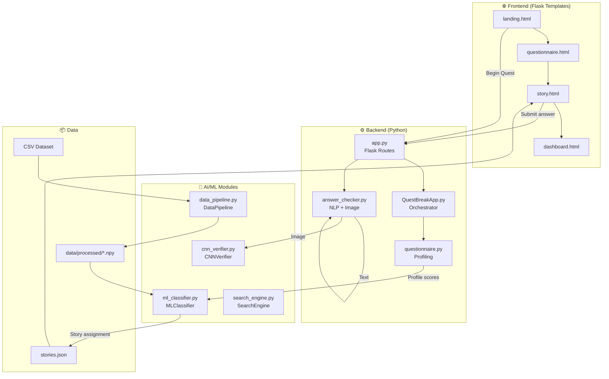
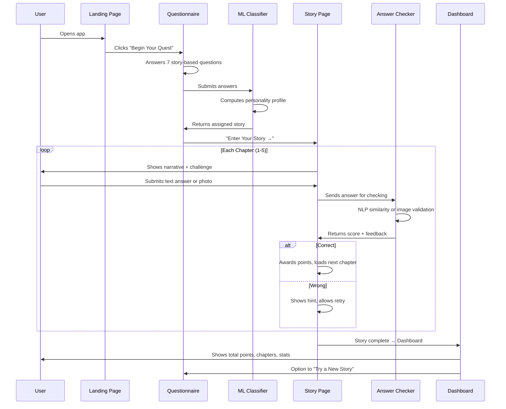

# QuestBreak AI — Full Project Guide

> An AI-powered, story-based anti-doomscrolling web application that uses Machine Learning, Search Algorithms, Deep Learning (CNNs), and NLP to transform passive screen time into interactive quests.

---

## Table of Contents

1. [Project Overview](#project-overview)
2. [Tech Stack](#tech-stack)
3. [File Structure](#file-structure)
4. [Architecture & Data Flow](#architecture--data-flow)
5. [Module-by-Module Breakdown](#module-by-module-breakdown)
6. [AI/ML Concepts Used (Course Outcome Mapping)](#aiml-concepts-used)
7. [How to Run](#how-to-run)
8. [User Flow Walkthrough](#user-flow-walkthrough)

---

## Project Overview

**QuestBreak** is a gamified web app designed to combat doomscrolling among Gen-Z users. Instead of endlessly scrolling social media, users are pulled into an interactive **story-based treasure hunt** where they solve riddles, upload real-world photos, and complete challenges — all verified and personalized by AI.

**Core Idea:**
1. User answers a **story-based personality questionnaire**
2. An ML classifier assigns them **one of 4 themed stories**
3. Each story has **5 chapters** with text riddles or photo challenges
4. Answers are verified using **NLP (text)** or **CNNs (images)**
5. Users earn **dopamine points** — rewiring their reward loops away from scrolling

---

## Tech Stack

| Layer | Technology |
|-------|-----------|
| **Backend** | Python 3, Flask |
| **Frontend** | HTML5, CSS3 (Glassmorphism dark-mode), Vanilla JavaScript |
| **ML Models** | Scikit-learn (Logistic Regression, Decision Trees, Random Forest, SVM, K-Means) |
| **Deep Learning** | TensorFlow / Keras (LeNet, AlexNet, ResNet50) |
| **NLP** | TF-IDF Vectorization + Cosine Similarity (Scikit-learn) |
| **Data Processing** | NumPy, Pandas, SciPy, SMOTE (imbalanced-learn) |
| **Search Algorithms** | BFS, DFS, A*, Hill Climbing |
| **Dataset** | `genz_mental_wellness_synthetic_dataset.csv` (Kaggle) |

---

## File Structure

```
AIML Project/
│
├── app.py                     ← Flask web server (routes & API)
├── QuestBreakApp.py            ← Backend orchestrator (connects all modules)
├── data_pipeline.py            ← Data loading, cleaning, feature engineering
├── ml_classifier.py            ← ML model training & prediction
├── search_engine.py            ← Search algorithms for quest selection
├── cnn_verifier.py             ← CNN architectures for image verification
├── questionnaire.py            ← Story-based profiling questionnaire
├── answer_checker.py           ← NLP text checking + image validation
├── stories.json                ← 4 stories × 5 chapters (content data)
├── requirements.txt            ← Python dependencies
│
├── genz_mental_wellness_synthetic_dataset.csv  ← Source dataset
│
├── templates/                  ← Jinja2 HTML templates
│   ├── base.html               ← Shared layout (fonts, CSS, JS)
│   ├── landing.html            ← Home page
│   ├── questionnaire.html      ← Interactive profiling quiz
│   ├── story.html              ← Chapter gameplay view
│   └── dashboard.html          ← Stats & completion screen
│
├── static/
│   ├── css/style.css           ← Full dark-mode stylesheet
│   └── js/app.js               ← Particle animations
│
├── uploads/                    ← User-uploaded images (photo challenges)
├── data/processed/             ← Exported ML training data (.npy files)
└── .venv/                      ← Python virtual environment
```

---

## Architecture & Data Flow



---

## Module-by-Module Breakdown

### 1. `app.py` — Flask Web Server

The entry point for the web application. Defines all HTTP routes:

| Route | Method | Purpose |
|-------|--------|---------|
| `/` | GET | Landing page |
| `/questionnaire` | GET | Show profiling quiz |
| `/submit_questionnaire` | POST | Process answers → assign story |
| `/story/<story_id>` | GET | Start a story (redirect to chapter 1) |
| `/story/<id>/chapter/<id>` | GET | Display a specific chapter |
| `/submit_answer` | POST | Check text or image answer |
| `/dashboard` | GET | Show stats & completion |

Uses Flask sessions to persist `story_id`, `total_points`, and `chapters_completed` across requests.

---

### 2. `QuestBreakApp.py` — Backend Orchestrator

The **central controller** that connects all AI/ML modules. Key methods:

| Method | What it does |
|--------|-------------|
| `process_questionnaire(answers)` | Converts quiz answers → personality profile → assigns a story |
| `get_chapter(story_id, chapter_id)` | Returns chapter content from `stories.json` |
| `check_answer(...)` | Dispatches to `AnswerChecker` for text NLP or image validation |
| `get_story_progress(...)` | Calculates completion percentage for the progress bar |

---

### 3. `data_pipeline.py` — DataPipeline Class

Handles all data preprocessing. Maps the Kaggle CSV columns to the QuestBreak schema:

| CSV Column | → QuestBreak Feature |
|-----------|---------------------|
| `Screen_Time_Hours` | `session_duration_mins` (×60) |
| `Motivation_Level` | `quests_completed` |
| `Night_Scrolling_Frequency` | `login_hour` (scaled 20–24) |
| `Daily_Social_Media_Hours` | `streak_days` (scaled 1–30) |
| `Burnout_Risk == "High"` | `doomscroll_triggered` (binary target) |

**Processing pipeline:**
1. **Load** data (real CSV or simulated)
2. **Clean** — remove duplicates, nulls, clip outliers
3. **Log transform** — normalizes right-skewed screen time (scipy `normaltest`)
4. **Feature engineering** — creates `hourly_intensity`, `quest_overdue_flag`, `late_night_flag`
5. **Standard scaling** — mean=0, std=1 via `StandardScaler`
6. **SMOTE balancing** — synthetic oversampling of minority class
7. **Train/test split** — 80/20 with stratification, exported as `.npy`

---

### 4. `ml_classifier.py` — MLClassifier Class

Trains and evaluates **4 supervised models + 1 unsupervised model:**

| Model | Type | Library |
|-------|------|---------|
| Logistic Regression | Supervised | `sklearn.linear_model` |
| Decision Tree | Supervised | `sklearn.tree` |
| Random Forest | Supervised | `sklearn.ensemble` |
| SVM | Supervised | `sklearn.svm` |
| K-Means (k=3) | Unsupervised | `sklearn.cluster` |

**Key methods:**
- `train_all(X_train, y_train)` — fits all models
- `evaluate_all(X_test, y_test)` — compares accuracy, selects best
- `predict_craving(features)` — returns doomscrolling probability (0–1)
- `feature_importance(names)` — shows which features matter most

---

### 5. `search_engine.py` — SearchEngine Class

Implements **4 search algorithms** to find the optimal quest/chapter for a user:

| Algorithm | Strategy | Use Case |
|-----------|----------|----------|
| **BFS** | Breadth-first exploration | Find easiest available quest |
| **DFS** | Depth-first exploration | Explore quest chains deeply |
| **A*** | Heuristic-guided (difficulty distance) | Find quest closest to target difficulty |
| **Hill Climbing** | Local optimization | Iteratively improve quest match |

The `get_best_quest(user_state)` method picks difficulty based on user streak and delegates to A*.

---

### 6. `cnn_verifier.py` — CNNVerifier Class

Implements **3 CNN architectures** using TensorFlow/Keras for image-based challenge verification:

| Architecture | Input Size | Description |
|-------------|-----------|-------------|
| **LeNet** | 32×32×3 | Classic lightweight CNN (2 conv layers) |
| **AlexNet** | 227×227×3 | Deeper with larger kernels (stride-4 first conv) |
| **ResNet50** | 224×224×3 | Pre-built residual network with transfer learning |

The `verify_photo(path)` method processes uploaded user photos. Currently uses simulated verification — the architecture is production-ready for training with a labeled dataset.

---

### 7. `questionnaire.py` — Story-Based Profiling

Contains **7 narrative-wrapped questions**. Each answer maps to 5 personality traits:

| Trait | What it Measures |
|-------|-----------------|
| `risk` | Appetite for danger and action |
| `creativity` | Preference for imagination and art |
| `logic` | Analytical and problem-solving tendency |
| `social` | Need for human connection |
| `patience` | Tolerance for delayed gratification |

**Story assignment formula:**

| Story | Weighted Score |
|-------|---------------|
| 🏴‍☠️ Adventure | `risk×2 + patience` |
| 🔮 Fantasy | `creativity×2 + social` |
| 🚀 Sci-Fi | `logic×2 + patience` |
| 🕵️ Espionage | `social + logic + risk` |

The story with the highest score is assigned.

---

### 8. `answer_checker.py` — NLP + Image Verification

Supports **3 answer types:**

| Type | Method | How it Works |
|------|--------|-------------|
| `text` | TF-IDF + Cosine Similarity | Vectorizes user answer and expected answer, computes similarity score |
| `image` | File validation + CNNVerifier | Checks image is valid format & size, delegates to CNN |
| `choice` | Exact match | Simple string comparison |

**Text checking strategy (in order):**
1. Exact match (case-insensitive)
2. Keyword containment (`expected ⊆ user_answer`)
3. Full keyword overlap (`expected_words ⊆ user_words`)
4. TF-IDF cosine similarity (for longer answers)
5. Partial word overlap (fallback)

**Scoring thresholds:**
- `≥ 0.6` → ✅ Correct
- `0.3 – 0.6` → 🤔 Partial (hint offered)
- `< 0.3` → ❌ Incorrect

---

### 9. `stories.json` — Story Content

Contains **4 stories**, each with **5 chapters**:

| Story | Theme | Emoji |
|-------|-------|-------|
| The Lost Treasure of Captain Byte | Adventure / Exploration | 🏴‍☠️ |
| The Enchanted Algorithm | Fantasy / Magic | 🔮 |
| Mission: Deep Space Rescue | Sci-Fi / Problem-Solving | 🚀 |
| The Shadow Protocol | Espionage / Thriller | 🕵️ |

Each chapter has:
- `narrative` — story text the user reads
- `challenge` — the task to complete
- `answer_type` — `"text"` or `"image"`
- `expected_answer` — what the AI checks against
- `hint` — shown on wrong answers
- `difficulty` — 1 (easy) to 3 (hard)
- `points` — dopamine points earned
- `next_on_success` / `next_on_fail` — branching chapter IDs

---

## AI/ML Concepts Used

| Feature | Course Outcome | AI/ML Concept |
|---------|---------------|---------------|
| Data Pipeline | CO1 — Python & Libraries | NumPy, Pandas, SciPy, data cleaning, feature engineering |
| Quest Selection | CO2 — Search Techniques | BFS, DFS, A*, Hill Climbing |
| User Profiling & Prediction | CO3 — Machine Learning | Logistic Regression, Decision Trees, Random Forest, SVM |
| User Clustering | CO3 — Unsupervised Learning | K-Means Clustering |
| Answer Checking (Text) | CO3 — NLP/Data Analysis | TF-IDF Vectorization, Cosine Similarity |
| Image Verification | CO4 — Deep Neural Networks | LeNet, AlexNet, ResNet50 (TensorFlow/Keras) |
| Data Balancing | CO3 — Class Imbalance | SMOTE (Synthetic Minority Oversampling) |
| Normality Testing | CO1 — Statistics | D'Agostino-Pearson test, Log Transform |

---

## How to Run

### 1. Set up the virtual environment (first time only)

```bash
cd "/home/aarushb/Desktop/AIML Project"
python3 -m venv .venv
```

### 2. Activate the virtual environment

```bash
source .venv/bin/activate
```

### 3. Install dependencies

```bash
pip install -r requirements.txt
```

### 4. Start the app

```bash
python app.py
```

### 5. Open in browser

Navigate to **http://127.0.0.1:5000**

---

## User Flow Walkthrough



### Step-by-step:

1. **Landing Page** → User sees the app intro and 4 story previews
2. **Questionnaire** → 7 questions wrapped in a narrative ("You wake up in a white room..."). Each answer maps to personality traits
3. **Story Reveal** → A modal reveals which story was assigned with its description
4. **Story Chapters** → User reads the narrative, then:
   - **Text challenges**: Type an answer (riddle, code bug, cipher)
   - **Image challenges**: Upload a real-world photo (plant, water bottle, book)
5. **Answer Checking** → AI evaluates using NLP similarity or image validation
6. **Feedback** → Correct (🎉 + points), Partial (🤔 + hint), Wrong (❌ + retry)
7. **Exit Option** → User can quit anytime via the "✕ Exit" button with a confirmation dialog
8. **Dashboard** → Shows dopamine points, chapters completed, and a motivational message
